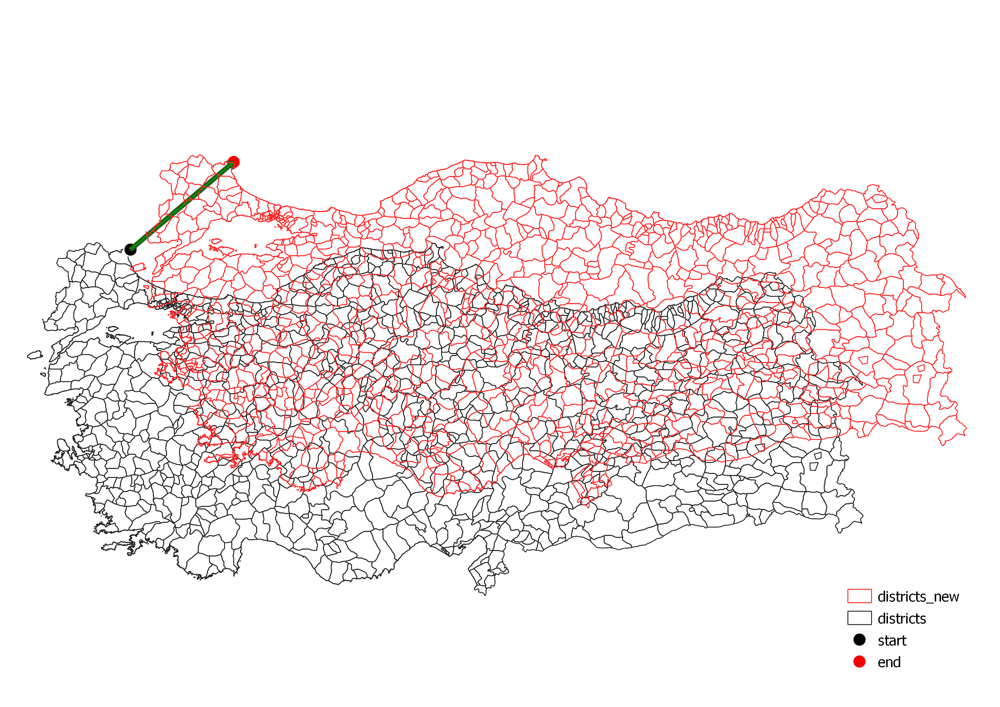

# QGIS Move Feature Plugin

With this plugin, it is possible to move features from one location to another. For correct results please be sure that the layer and the canvas have same coordinate reference system.

For doing this, 4 method can be used: 
**1-)** Provide layers for reference points. 
**2-)** Provide coordinates for reference points by typing manually. 
**3-)** Provide Δx and Δy values by typing manually. 
**4-)** Provide reference points by selecting them from canvas. 

* The plugin can be downloaded from: <a href="https://plugins.qgis.org/plugins/moving_feature/" target="_blank">https://plugins.qgis.org/plugins/moving_feature/</a>

<table>
	<tr>
		<td></td>
		<td></td>
	</tr>
	<tr>
		<td></td>
		<td></td>
	</tr>
	<tr>
		<td colspan=2></td>
	</tr>
	</table>
