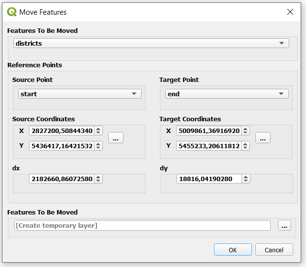

# QGIS Move Feature Plugin

With this plugin, it is possible to move features from one location to another. For correct results please be sure that the layer and the canvas have same coordinate reference system.

* The plugin can be downloaded from: <a href="https://plugins.qgis.org/plugins/moving_feature/" target="_blank">https://plugins.qgis.org/plugins/moving_feature/</a>

For this process, 4 methods can be used: 

### 1-) Provide layers for reference points.
In this method; one point layer that contains 1 feature(start reference point), one point layer that contains 1 feature(end reference point) and a layer(to be moved) must be provided. 

### 2-)Provide coordinates for reference points by typing manually.
In this method; the coordinates for start reference point and end reference point must be typed manually and a layer(to be moved) must be provided. 

### 3-) Provide Δx and Δy values by typing manually.
In this method; the horizontal(Δx) and vertical(Δy) differences between start and end point must be typed manually and a layer(to be moved) must be provided. 

### 4-) Provide reference points by selecting them from canvas.
In this method; start reference point and end reference point must be selected from canvas and a layer(to be moved) must be provided. 

### With new version(2.0) source and target coordinates can be chosen by using different methods. This feature makes the plugin more flexible.  

  

 

### The result output:
After the process, the layer(to be moved) is moved to the target location based on given reference points. 

  

 
